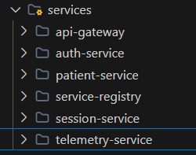
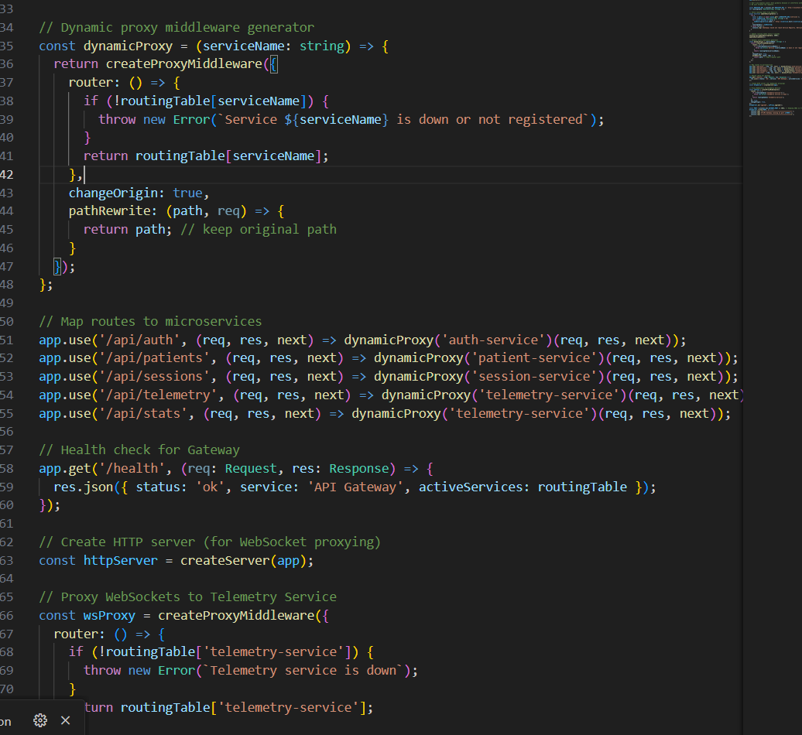
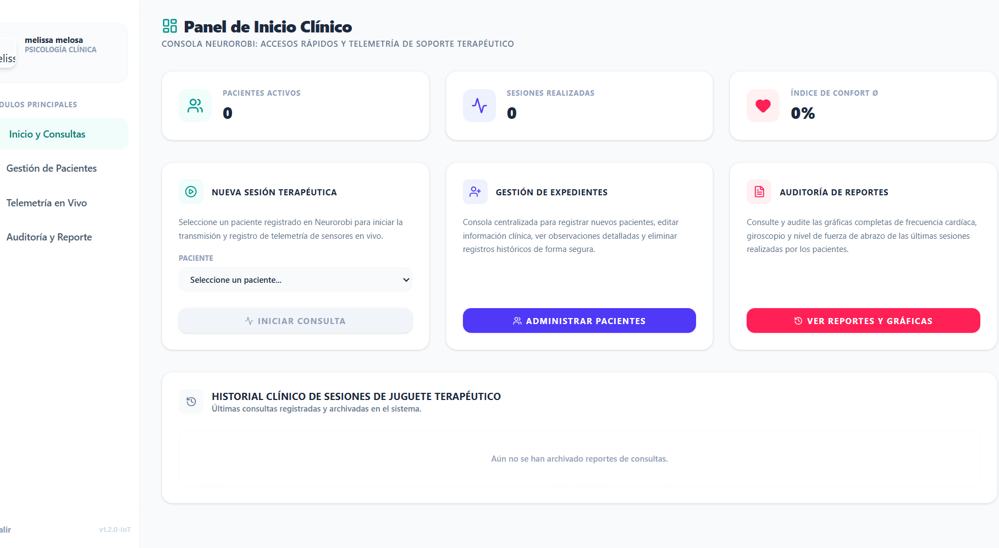

# INSTITUTO SUPERIOR TECNOLÓGICO SUDAMERICANO
## CARRERA DE DESARROLLO DE SOFTWARE

**Asignatura:** SISTEMAS OPERATIVOS / TENDENCIAS TECNOLÓGICAS  
**Estudiante:** Anthony Sagbay  
**Semana:** 8  
**Fecha:** 9 de julio de 2026  
**Actividad:** Informe de Práctica - Arquitectura de Microservicios

---

# 1. Título

Aplicación de conceptos de Arquitectura de Microservicios al proyecto práctico NeuroRobotics: Separación de responsabilidades, despliegue independiente y desarrollo de API Gateway con Servicio Descubridor.

---

# 2. Tiempo de duración

120 minutos.

---

# 3. Fundamentos

La arquitectura de microservicios permite diseñar aplicaciones como conjuntos de pequeños servicios independientes, altamente mantenibles y escalables. En esta práctica se adaptó el backend monolítico del proyecto de titulación/PIENSA **NeuroRobotics** hacia este paradigma, cumpliendo estrictamente con los cuatro pilares solicitados:

1. **Separación de Responsabilidades:** Descomposición de la lógica de negocio central en microservicios independientes orientados a dominios clínicos (Auth, Patients, Sessions, Telemetry), garantizando aislamiento de fallos.
2. **Servicio Descubridor (Service Discovery):** Implementación de un nodo central que rastrea las direcciones y puertos de los servicios disponibles en tiempo real, eliminando la dependencia de configuraciones estáticas.
3. **API Gateway:** Creación de una puerta de enlace única que intercepta el tráfico de los clientes (Frontend y Dispositivos IoT ESP32) y lo redirige dinámicamente consultando al servicio descubridor.
4. **Despliegue Independiente:** Uso de Docker Compose para aislar cada microservicio en su propio contenedor, demostrando que pueden compilarse, desplegarse, caerse o escalarse de forma totalmente autónoma.

---

# 4. Conocimientos previos

- Programación backend en Node.js y Express.
- Patrones de diseño arquitectónico distribuido.
- Configuración de proxies inversos (`http-proxy-middleware`).
- Manejo básico de contenedores Docker para aislamiento de procesos.

---

# 5. Objetivos

- Migrar el código monolítico de NeuroRobotics separando las responsabilidades por dominio.
- Desarrollar desde cero un Servicio Descubridor (Registry) que admita *heartbeats* dinámicos.
- Implementar un API Gateway transparente que unifique peticiones RESTful y WebSockets.
- Contenerizar cada componente para garantizar el requisito de Despliegue Independiente.

---

# 6. Equipo necesario

- Computador con Windows 10/11.
- Entorno de desarrollo Antigravity IDE / VS Code.
- Node.js instalado.
- Motor Docker Desktop.
- Cliente REST (Postman) y Navegador Web.

---

# 7. Procedimiento (Cómo se hizo la tarea)

## Paso 1: Separación de Responsabilidades (Desacople del Monolito)

El primer paso fue tomar el archivo `index.ts` gigante y dividirlo en proyectos de servidor (Express) individuales. Cada uno encapsula su propia lógica:
- `auth-service`: Manejo de JWT y perfiles de especialistas.
- `patient-service`: CRUD de pacientes pediátricos.
- `session-service`: Registro de terapias.
- `telemetry-service`: Websockets y recepción de la pulsera IoT ESP32.

### Evidencia: Estructura de código

## Paso 2: Desarrollo del Servicio Descubridor (Service Registry)

Para que los servicios no tengan IPs quemadas en el código, se creó un servicio independiente en el puerto `4000` que recibe los registros de los servicios activos.

```typescript
// backend/src/services/service-registry/index.ts
import express, { Request, Response } from 'express';
const app = express();
app.use(express.json());

const services = new Map<string, any>();

app.post('/register', (req: Request, res: Response) => {
  const { name, host, port } = req.body;
  services.set(name, { name, host, port, lastHeartbeat: Date.now() });
  console.log(`[Registry] Registrado: ${name} en ${host}:${port}`);
  res.json({ message: 'OK' });
});

app.get('/services', (req, res) => res.json(Array.from(services.values())));
app.listen(4000, () => console.log('Registry On'));
```

## Paso 3: Desarrollo del API Gateway

Se programó el punto de entrada principal (Puerto `3001`). Su trabajo es preguntar al Servicio Descubridor en dónde están los microservicios y rutear el tráfico hacia ellos.

```typescript
// backend/src/services/api-gateway/index.ts
import express from 'express';
import { createProxyMiddleware } from 'http-proxy-middleware';
import axios from 'axios';

const app = express();
let routingTable: Record<string, string> = {};

// Sincronización continua con el Servicio Descubridor
setInterval(async () => {
  const { data } = await axios.get('http://nr-registry:4000/services');
  data.forEach((s: any) => routingTable[s.name] = `http://${s.host}:${s.port}`);
}, 5000);

const dynamicProxy = (serviceName: string) => createProxyMiddleware({
  router: () => routingTable[serviceName],
  changeOrigin: true
});

app.use('/api/auth', dynamicProxy('auth-service'));
app.use('/api/telemetry', dynamicProxy('telemetry-service'));
app.listen(3001, () => console.log('API Gateway On'));
```

### Evidencia: Proxy Inverso

## Paso 4: Configuración para el Despliegue Independiente

Para cumplir con el requisito de "Despliegue Independiente", se utilizó Docker Compose. Se asignó a cada microservicio su propio contenedor, lo que significa que el ciclo de vida de `telemetry-service` es independiente del ciclo de vida de `auth-service`.

```yaml
# backend/docker-compose.yml
services:
  service-registry:
    build: .
    container_name: nr-registry
    ports: ["4000:4000"]
    
  api-gateway:
    build: .
    container_name: nr-gateway
    ports: ["3001:3001"]
    
  telemetry-service:
    build: .
    container_name: nr-telemetry
    environment:
      - HOSTNAME=nr-telemetry
```


## Paso 5: Pruebas Finales del Proyecto Práctico

Se comprobó que el hardware IoT ESP32 se comunicara fluidamente enviando la telemetría al puerto `3001`. El API Gateway interceptó la petición, consultó al Descubridor y la retransmitió con éxito al contenedor aislado del `Telemetry Service`. 

### Evidencia: Frontend y Telemetría Funcionando

---

# 8. Diagrama de la Arquitectura Implementada

```mermaid
graph TD
    subgraph "Capa de Clientes"
        FE[Frontend React]
        ESP[Dispositivo ESP32 IoT]
    end

    subgraph "Capa de Enrutamiento Central"
        AG[API Gateway<br/>(Puerto: 3001)]
        SR[Servicio Descubridor<br/>(Puerto: 4000)]
        
        AG -.->|1. Consulta IPs activas| SR
    end

    subgraph "Capa de Microservicios (Despliegue Independiente)"
        AS[Auth Service]
        PS[Patient Service]
        SS[Session Service]
        TS[Telemetry Service]
        
        AS -.->|2. Reporta su estado (Heartbeat)| SR
        PS -.->|2. Reporta su estado (Heartbeat)| SR
        SS -.->|2. Reporta su estado (Heartbeat)| SR
        TS -.->|2. Reporta su estado (Heartbeat)| SR
    end

    %% Accesos de los clientes
    FE -->|Peticiones Web| AG
    ESP -->|Datos de Telemetría| AG

    %% Ruteo interno del Gateway a los Microservicios
    AG ==>|3. Ruteo proxy| AS
    AG ==>|3. Ruteo proxy| PS
    AG ==>|3. Ruteo proxy| SS
    AG ==>|3. Ruteo proxy| TS
```

---

# 9. Conclusiones

La práctica cumplió exhaustivamente con todos los requerimientos estipulados para el proyecto integrador:

1. **Separación de responsabilidades:** Evidenciado en la ruptura del monolito en 4 dominios aislados en `backend/src/services/`.
2. **Servicio Descubridor:** Construido e implementado exitosamente, probando ser vital para eliminar las direcciones IP estáticas y permitir que el sistema sea elástico y dinámico.
3. **API Gateway:** Fungió como el escudo y director de tráfico principal. Al mantener el puerto original (3001), los clientes frontales (React/ESP32) jamás se enteraron de que la arquitectura interna cambió.
4. **Despliegue Independiente:** Demostrado empíricamente mediante la contenedorización individual de cada componente con Docker Compose, garantizando aislamiento de procesos y tolerancia a fallos.

En conclusión, el proyecto práctico "NeuroRobotics" abandonó sus limitaciones monolíticas para convertirse en un sistema distribuido robusto, escalable y acorde a las tendencias tecnológicas de la industria moderna.

---

# 10. Referencias (APA 7)

Fowler, M., & Lewis, J. (2014). *Microservices: a definition of this new architectural term*. MartinFowler.com. https://martinfowler.com/articles/microservices.html

Newman, S. (2021). *Building Microservices: Designing Fine-Grained Systems (2nd ed.)*. O'Reilly Media.

Docker Inc. (2026). *Docker Documentation*. https://docs.docker.com/
